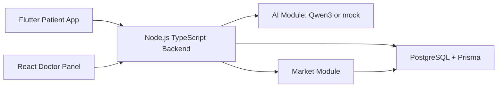

# Halyk Health MVP

Halyk Health is a medical and pharmacy MVP for the Halyk ecosystem. A patient books a doctor appointment, a doctor creates a digital prescription, the backend parses it through a Qwen3-ready AI module, and the patient sees medicine cards, alternatives, cart actions, and a medication schedule.

The AI agent does not diagnose and does not prescribe treatment. It only explains and structures a doctor's prescription.

> ИИ-агент не заменяет врача. Он объясняет назначение, созданное врачом. Перед заменой препарата проконсультируйтесь с врачом или фармацевтом.

## Architecture



Monorepo:

- `backend` - Express + TypeScript API, Prisma, Swagger, JWT, Qwen3-ready AI module.
- `doctor-panel` - React + TypeScript + Vite doctor web cabinet.
- `mobile-app` - Flutter patient app.
- `docker-compose.yml` - PostgreSQL and backend services.
- `docs/Halyk Health Architecture.md` - Obsidian-friendly architecture note.

## Stack

- Mobile: Flutter / Dart, `http`, Material 3.
- Doctor panel: React, TypeScript, Vite, lucide-react.
- Backend: Node.js, Express, TypeScript, Prisma, JWT, Swagger.
- Database: PostgreSQL locally or Supabase PostgreSQL for shared team access.
- AI: Qwen3 adapter with mock fallback when `QWEN_API_KEY` is empty.
- Deployment: Docker and docker-compose.

## Backend Run

```bash
cd /Users/justalim/projects/Synex/halyk-health
docker compose up -d postgres

cd backend
cp .env.example .env
npm install
npm run prisma:generate
npm run prisma:push
npm run prisma:seed
npm run dev
```

Backend URL: `http://localhost:4000`

Swagger: `http://localhost:4000/api/docs`

OpenAPI JSON: `http://localhost:4000/api/openapi.json`

## Supabase Team Database

For shared development, create a Supabase project and put its PostgreSQL URL into `backend/.env` as `DATABASE_URL`.

```bash
cd /Users/justalim/projects/Synex/halyk-health/backend
cp .env.example .env
# replace DATABASE_URL with the Supabase Postgres connection string
npm run prisma:generate
npm run prisma:push
npm run prisma:seed
```

See `docs/Supabase Setup.md` for the full team workflow. Flutter and React must keep using the backend API only; Supabase credentials stay on the backend.

## Docker Run

```bash
cd /Users/justalim/projects/Synex/halyk-health
docker compose up --build
```

PostgreSQL is exposed on local port `5433`, while containers use `postgres:5432`.

## Prisma

```bash
cd /Users/justalim/projects/Synex/halyk-health/backend
npm run prisma:generate
npm run prisma:push
npm run prisma:seed
```

Schema: `backend/prisma/schema.prisma`

Seed: `backend/prisma/seed.ts`

## Doctor Panel Run

```bash
cd /Users/justalim/projects/Synex/halyk-health/doctor-panel
npm install
npm run dev
```

Doctor panel URL: `http://localhost:5173`

Optional API override:

```bash
VITE_API_URL=http://localhost:4000/api npm run dev
```

## Flutter App Run

```bash
cd /Users/justalim/projects/Synex/halyk-health/mobile-app
flutter pub get
flutter run -d chrome --dart-define=API_URL=http://localhost:4000/api
```

For Android emulator use:

```bash
flutter run --dart-define=API_URL=http://10.0.2.2:4000/api
```

## Test Accounts

- Patient: `patient@test.kz` / `123456`
- Doctor: `doctor@test.kz` / `123456`

## Main Scenario

1. Patient logs into Halyk Health.
2. Patient creates an appointment request.
3. Doctor logs into the web panel.
4. Doctor confirms or completes the appointment.
5. Doctor creates a prescription.
6. AI analysis parses the doctor's raw prescription text.
7. Patient sees explanation, medicines, dosage, frequency, and duration.
8. Backend matches medicines with pharmacy market products.
9. Patient views prices, stock, pharmacies, alternatives, and adds products to cart.
10. Backend creates medication schedule items.
11. Patient marks medicine intake as taken or missed.

## API Endpoints

Auth:

- `POST /api/auth/login`
- `POST /api/auth/register`
- `GET /api/auth/me`

Clinics:

- `GET /api/clinics`
- `GET /api/clinics/:id`
- `GET /api/clinics/:id/doctors`

Appointments:

- `POST /api/appointments`
- `GET /api/appointments/my`
- `GET /api/doctor/appointments`
- `PATCH /api/appointments/:id/status`

Prescriptions:

- `POST /api/prescriptions`
- `GET /api/prescriptions/my`
- `GET /api/prescriptions/:id`
- `GET /api/doctor/prescriptions`
- `POST /api/prescriptions/:id/analyze-ai`
- `GET /api/prescriptions/:id/market-products`
- `GET /api/prescriptions/:id/schedule`

AI:

- `POST /api/ai/parse-prescription`

Market:

- `GET /api/market/products`
- `GET /api/market/search?query=`
- `GET /api/market/alternatives?activeSubstance=`
- `POST /api/market/cart`
- `GET /api/market/cart`

Schedule:

- `GET /api/schedule/my`
- `PATCH /api/schedule/:id/taken`
- `PATCH /api/schedule/:id/missed`

## Implemented

- Modular TypeScript backend with auth, users, clinics, appointments, prescriptions, AI, market, schedule, and notifications placeholder.
- Prisma schema with requested models and enums.
- Seed data for patient, doctor, clinic, appointment, and pharmacy products.
- JWT mock login/register flow.
- Qwen3-ready AI service with mock fallback.
- Medicine matching, alternatives, cart, and schedule generation.
- Swagger/OpenAPI documentation.
- Docker setup for PostgreSQL and backend.
- React doctor panel with login, dashboard, appointments, prescription creation, and prescriptions list.
- Flutter patient app with login, home, appointment creation, appointments, prescriptions, prescription detail, market, cart action, alternatives, and schedule.

## Next Steps

- Add clinic admin role screens.
- Add real Qwen3 API contract tests and response validation.
- Add payment and delivery flow for pharmacy orders.
- Add push notifications for medication reminders.
- Add audit logging for doctor actions and AI analysis.
- Add e2e tests for patient and doctor journeys.
- Add CI pipeline and production Docker images.
