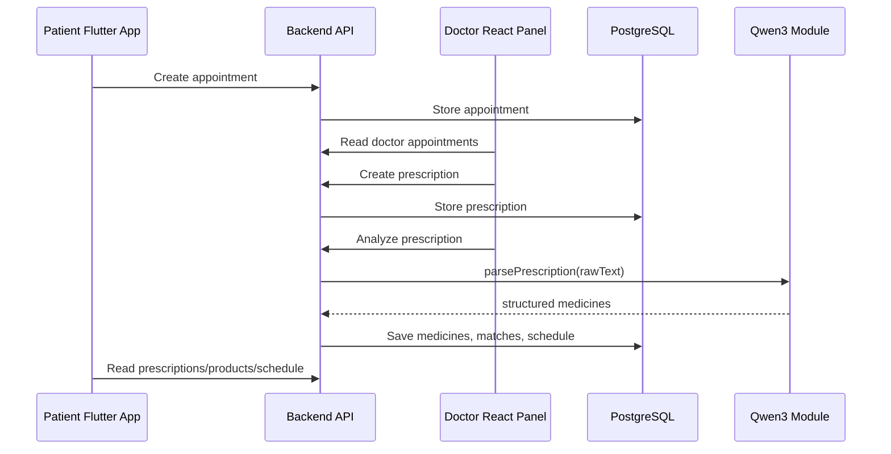

# Halyk Health Architecture

Tags: #synex #halyk-health #mvp #architecture

## Product idea

Halyk Health is a health section for a Halyk-style super app. The MVP connects patient appointment requests, doctor prescriptions, AI explanation, pharmacy product matching, cart, and medication schedule.

## Safety boundary

The AI agent does not diagnose and does not prescribe treatment. It only structures a doctor's prescription, explains it in simple language, extracts medicines, and helps find market products.

> ИИ-агент не заменяет врача. Он объясняет назначение, созданное врачом. Перед заменой препарата проконсультируйтесь с врачом или фармацевтом.

## Runtime view

## Modules

- Auth: mock login/register, JWT, roles `PATIENT`, `DOCTOR`, `ADMIN`.
- Users: basic profiles and doctor profile relation.
- Clinics: clinics and doctors by clinic.
- Appointments: patient requests and doctor status updates.
- Prescriptions: raw doctor text, diagnosis, AI summary, medicines.
- AI: Qwen3 integration point with mock fallback.
- Market: products, search, alternatives, cart.
- Schedule: generated reminders and taken/missed status.
- Notifications: placeholder for future push integration.

## Local paths

- Project: `/Users/justalim/projects/Synex/halyk-health`
- Backend: `/Users/justalim/projects/Synex/halyk-health/backend`
- Doctor panel: `/Users/justalim/projects/Synex/halyk-health/doctor-panel`
- Flutter app: `/Users/justalim/projects/Synex/halyk-health/mobile-app`

